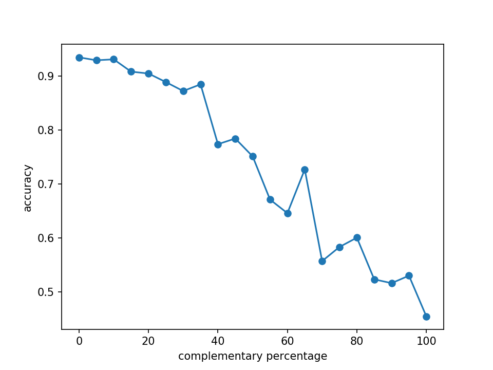
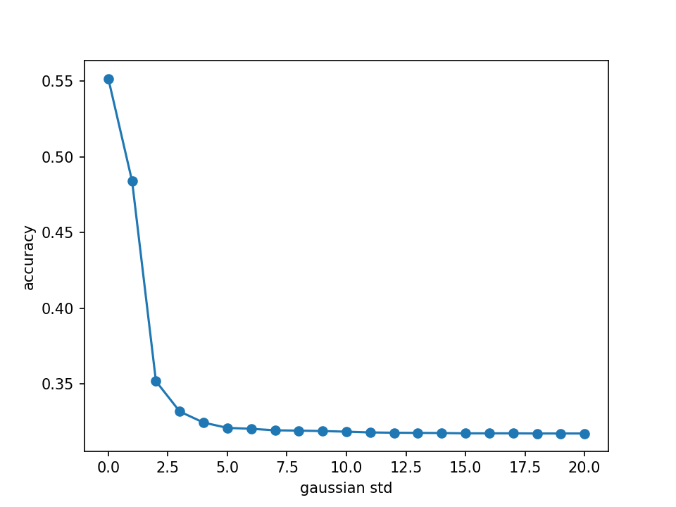

# Coding exercise with FashionMNIST
See how basic image processing affect inferencing quality.

## Training

The model was constructed with MobileNet and ImageNet pretrained weights. You can train the model with:

`python train.py`

## Inferencing

The prediction accuracy on the original testing data was 93.67%. After some basic image processing (complementary value, Gaussian blur) on the testing images, the accuracy decreases.

[Model checkpoint](https://drive.google.com/u/0/uc?id=1pK1094QRY_89B6QsDxLCM-PhM0Bhn_QU&export=download)

The model checkpoint can be obtained in the above link. Please put the files in `/weight` folders, then you can run the experiment with:

`python infer.py`

It can be seen that both process have a huge influence on the CNN.

### Accuracy vs percentage of the pixels converted to complementary value

### Accuracy vs std of the Gaussian 3x3 kernel

